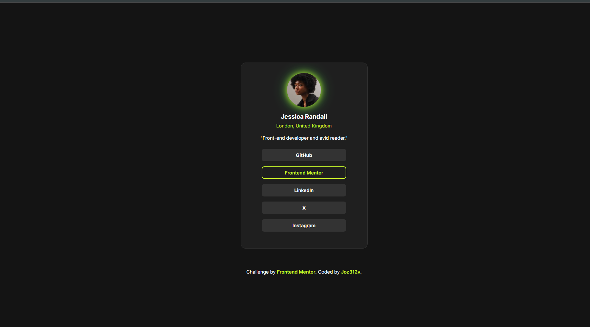

# Frontend Mentor - Social links profile solution

This is a solution to the [Social links profile challenge on Frontend Mentor](https://www.frontendmentor.io/challenges/social-links-profile-UG32l9m6dQ). Frontend Mentor challenges help you improve your coding skills by building realistic projects. 

## Table of contents

- [Overview](#overview)
  - [The challenge](#the-challenge)
  - [Screenshot](#screenshot)
  - [Links](#links)
- [My process](#my-process)
  - [Built with](#built-with)
  - [What I learned](#what-i-learned)
  - [Continued development](#continued-development)
  - [Useful resources](#useful-resources)
- [Author](#author)
- [Acknowledgments](#acknowledgments)

## Overview

### The challenge

Users should be able to:

- See hover and focus states for all interactive elements on the page

### Screenshot




### Links

- Solution URL: [Solution URL](https://github.com/Joz312v/social-links-challenge3.git)
- Live Site URL: [Live site URL](https://joz312v.github.io/social-links-challenge3/)

## My process

### Built with

- Semantic HTML5 markup
- CSS custom properties
- Flexbox & Responsive Design
- CSS Animation (Hover Effects & Transitions)


### What I learned

I found out about the :root in CSS is the same as making var varName = value in JavaScript

```css
:root {
    --main-color: hsl(75, 94%, 57%);
    --font-size: 16px;
}

body {
    color: var(--main-color);
    font-size: var(--font-size);
}
```

In JavaScipt
```js
const mainColor = "hsl(75, 94%, 57%)";
const fontSize = "16px";

document.body.style.color = mainColor;
document.body.style.fontSize = fontSize;
```


### Continued development

I had fun doing this, I challenged myself to explore more options on how to make the code simpler while keeping the complexity of outcome.


### Useful resources

- [MDN Web Docs](https://developer.mozilla.org/en-US/docs/Web/CSS/Using_CSS_custom_properties)- CSS variables :root
- [CSS Tricks](https://css-tricks.com/almanac/pseudo-selectors/r/root/) 


## Author

- Frontend Mentor - [@Joz312v](https://www.frontendmentor.io/profile/Joz312v)
- GitHub - [@Joz312v](https://github.com/Joz312v)


## Acknowledgments

There are bunch of great resources out there, like Stackoverflow to name one, you just have to think an idea and how to implement.


